# C4 Model — Diagrama de Componentes

**Sistema:** Bolsa de Trabajo Backend
**Contenedor:** API Application (Go / `net/http`)

Este diagrama muestra los componentes internos del contenedor de la API y cómo
se relacionan entre sí y con los sistemas externos. Los nombres propios de los
componentes se mantienen en su idioma original (tal como aparecen en el código);
las descripciones están en español.

```mermaid
C4Component
    title Diagrama de Componentes - API de la Bolsa de Trabajo

    Person(employee, "Employee", "Usuario que crea y completa su perfil profesional paso a paso")

    System_Ext(spa, "Frontend SPA", "Aplicación web de una sola página que consume la API")

    Container_Boundary(api, "API Application (Go net/http)") {

        Component(router, "Router", "Go net/http (1.22+)", "Enruta las peticiones HTTP a los handlers según método y ruta")

        Component(logger, "Logger Middleware", "Middleware", "Registra método, ruta, código de estado y duración de cada petición")
        Component(cors, "CORS Middleware", "Middleware", "Permite peticiones desde los orígenes del frontend con credenciales")
        Component(authUser, "AuthenticatedUser Middleware", "Middleware", "Valida el token JWT del header Authorization y extrae el userID al contexto")
        Component(authEmployee, "AuthenticatedEmployee Middleware", "Middleware", "Verifica que el usuario sea dueño del registro de employee solicitado")

        Component(userHandler, "UserHandler", "HTTP Handler", "Maneja registro, login y consulta del usuario actual")
        Component(employeeHandler, "EmployeeHandler", "HTTP Handler", "Maneja la creación y actualización del perfil del employee y sus secciones")
        Component(timezoneHandler, "TimezoneHandler", "HTTP Handler", "Expone el listado de zonas horarias disponibles")

        Component(userService, "UserService", "Service", "Lógica de autenticación: registro, login y generación de tokens")
        Component(employeeService, "employeeService", "Service", "Orquesta las operaciones del perfil y la limpieza de archivos huérfanos")
        Component(timezoneService, "timezoneService", "Service", "Lógica de negocio para la consulta de zonas horarias")

        Component(authPkg, "auth", "Package", "Hashing de contraseñas con Argon2id y creación/validación de JWT y refresh tokens")
        Component(filesPkg, "files", "Package", "Extrae y valida archivos PDF de las peticiones multipart")
        Component(uploaderService, "uploaderService", "Service", "Sube y elimina archivos en S3 usando el transfer manager del AWS SDK v2")

        Component(userRepo, "UserRepository", "Repository", "Acceso a datos de usuarios y refresh tokens")
        Component(employeeRepo, "EmployeeRepository", "Repository", "Acceso a datos del perfil del employee con soporte transaccional")
        Component(timezoneRepo, "TimezoneRepository", "Repository", "Consulta directa de zonas horarias del sistema")

        Component(queries, "Queries (sqlc)", "Data Access", "Consultas SQL tipadas generadas por sqlc para PostgreSQL")
    }

    ContainerDb_Ext(db, "PostgreSQL", "Base de datos", "Almacena usuarios, tokens, perfiles de employees y metadatos de archivos")
    System_Ext(s3, "AWS S3", "Almacenamiento de objetos para los documentos de certificación (PDF)")

    Rel(employee, spa, "Usa", "HTTPS")
    Rel(spa, router, "Realiza peticiones a la API", "JSON/HTTPS")

    Rel(router, logger, "Pasa por")
    Rel(logger, cors, "Pasa por")
    Rel(cors, userHandler, "Enruta a")
    Rel(cors, timezoneHandler, "Enruta a")
    Rel(cors, authUser, "Rutas protegidas pasan por")
    Rel(authUser, authEmployee, "Rutas de employee pasan por")
    Rel(authUser, userHandler, "Enruta a (/auth/me)")
    Rel(authEmployee, employeeHandler, "Enruta a")

    Rel(userHandler, userService, "Invoca")
    Rel(employeeHandler, employeeService, "Invoca")
    Rel(timezoneHandler, timezoneService, "Invoca")

    Rel(userService, authPkg, "Hashea contraseñas y genera tokens con")
    Rel(authUser, authPkg, "Valida JWT con")
    Rel(employeeHandler, filesPkg, "Valida archivos PDF con")
    Rel(employeeService, uploaderService, "Sube y elimina certificaciones con")

    Rel(userService, userRepo, "Lee y escribe datos con")
    Rel(employeeService, employeeRepo, "Lee y escribe datos con")
    Rel(timezoneService, timezoneRepo, "Consulta datos con")

    Rel(userRepo, queries, "Ejecuta consultas con")
    Rel(employeeRepo, queries, "Ejecuta consultas con")

    Rel(queries, db, "Lee y escribe", "SQL/lib-pq")
    Rel(timezoneRepo, db, "Consulta pg_timezone_names", "SQL/lib-pq")
    Rel(uploaderService, s3, "Almacena y elimina objetos", "AWS SDK v2 / HTTPS")
```

## Componentes principales

| Componente | Tipo | Descripción (ES) |
|------------|------|------------------|
| `Router` | Go net/http | Enruta las peticiones HTTP a los handlers |
| `Logger Middleware` | Middleware | Registra datos de cada petición |
| `CORS Middleware` | Middleware | Controla los orígenes permitidos |
| `AuthenticatedUser Middleware` | Middleware | Valida el JWT y extrae el userID |
| `AuthenticatedEmployee Middleware` | Middleware | Verifica la propiedad del registro de employee |
| `UserHandler` / `EmployeeHandler` / `TimezoneHandler` | HTTP Handler | Reciben y validan las peticiones |
| `UserService` / `employeeService` / `timezoneService` | Service | Contienen la lógica de negocio |
| `auth` | Package | Hashing Argon2id y manejo de JWT/refresh tokens |
| `files` | Package | Validación de archivos PDF |
| `uploaderService` | Service | Integración con AWS S3 |
| `UserRepository` / `EmployeeRepository` / `TimezoneRepository` | Repository | Acceso a datos |
| `Queries (sqlc)` | Data Access | Consultas SQL tipadas |

## Sistemas externos

- **Frontend SPA** — cliente que consume la API.
- **PostgreSQL** — base de datos principal.
- **AWS S3** — almacenamiento de los documentos de certificación.
